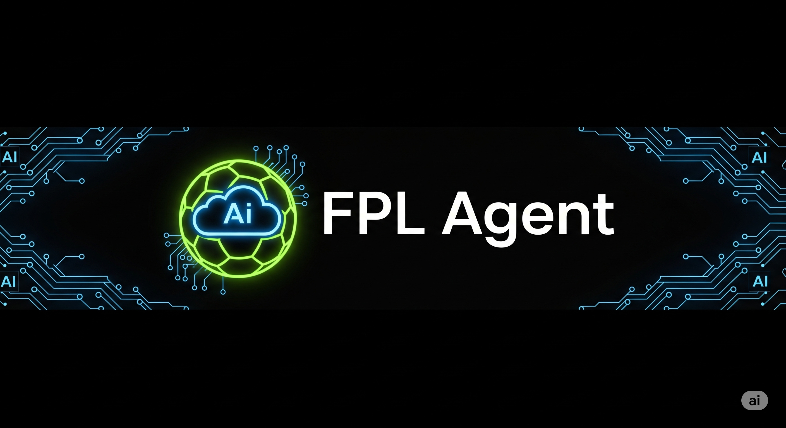

# FPL Model Context Protocol (MCP) Application



## Empowering AI with Real-time FPL Insights

This repository presents a robust, full-stack application designed to bridge the gap between dynamic Fantasy Premier League (FPL) data and intelligent AI agents. By leveraging Google Cloud services, it provides a scalable and efficient solution for delivering contextualized FPL information, enabling AI to offer insightful analysis and recommendations.

The project is structured into three core components:

1.  **FPL Model Context Protocol (MCP) Server:** The data backbone, responsible for ingesting, processing, and serving FPL data.
2.  **FPL Agent:** An intelligent AI agent powered by Vertex AI Agent Engine, capable of understanding FPL queries and utilizing tools to provide answers.
3.  **Frontend:** A user-friendly web interface for seamless interaction with the FPL Agent.
4.  **FPL Backend:** A Flask application acting as a proxy between the Frontend and the Vertex AI Agent Engine.

## Project Structure

-   `fpl-mcp-server/`: Contains the FastAPI application for FPL data management and serving.
-   `fpl-agent/`: Houses the Vertex AI Agent Engine agent definition and related tools.
-   `frontend/`: The React-based web application for user interaction.
-   `fpl-backend/`: The Flask proxy server for the Vertex AI Agent Engine.

## 1. FPL Model Context Protocol (MCP) Server

The FPL MCP Server is a high-performance FastAPI application designed to be the authoritative source of FPL data for AI agents. It meticulously fetches, transforms, and stores FPL data, making it readily accessible and contextually rich.

### Deploying the MCP Server to Google Cloud Run

**Prerequisites:**

*   **Google Cloud Project:** An active GCP project with billing enabled.
*   **Google Cloud SDK (`gcloud`):** Installed and authenticated to your GCP project.
*   **Firestore:** Enabled in your GCP project.
*   **Artifact Registry:** Enabled in your GCP project.

**Deployment Steps:**

1.  **Clone the Repository:**
    ```bash
    git clone https://github.com/your-username/fpl-mcp-adk.git
    cd fpl-mcp-adk/fpl-mcp-server
    ```

2.  **Configure Environment Variables:**
    Create a `.env` file in the `fpl-mcp-server/` directory. **Do NOT commit this file to Git.**

    ```ini
    # fpl-mcp-server/.env
    GCP_PROJECT_ID="your-gcp-project-id"
    FPL_API_BASE_URL="https://fantasy.premierleague.com/api"
    SYNC_INTERVAL_HOURS=2
    SYNC_SECRET="your-strong-secret-api-key-for-sync"
    ```

3.  **Set up GCP Project and Services:**
    Run the setup script to enable necessary APIs, create an Artifact Registry repository, and configure IAM permissions.
    ```bash
    chmod +x setup_gcp_project.sh
    ./setup_gcp_project.sh
    ```

4.  **Build and Deploy to Cloud Run:**
    This step uses a helper script to build the Docker image using Google Cloud Build and then deploy the new image to Cloud Run. The script handles all the necessary configuration and flags.

    Navigate to the `deployment` directory and run the script:
    ```bash
    cd deployment
    chmod +x deploy.sh
    ./deploy.sh
    ```
    Note the URL of your deployed Cloud Run service.

5.  **Initial Data Synchronization:**
    Trigger an initial data sync to populate your Firestore database.
    ```bash
    curl -X POST "YOUR_CLOUD_RUN_URL/api/v1/sync" -H "X-API-Key: YOUR_SYNC_SECRET"
    ```

## 2. FPL Agent

The FPL Agent is the intelligent core of this application, built upon the powerful Vertex AI Agent Engine.

### Deploying the FPL Agent to Vertex AI Agent Engine

**Prerequisites:**

*   **Deployed MCP Server:** The FPL MCP Server must be deployed and accessible.
*   **Google Cloud Project:** Same GCP project as the MCP Server.
*   **Vertex AI API:** Enabled in your GCP project.

**Deployment Steps:**

1.  **Navigate to the Agent Directory:**
    ```bash
    cd ../fpl-agent
    ```

2.  **Install Dependencies and Build:**
    ```bash
    poetry install
    poetry build --format=wheel --output=deployment
    ```

3.  **Deploy/Manage the Agent:**
    *   **Create a new agent:**
        ```bash
        python3 deployment/deploy.py --create
        ```
        Make a note of the `resource_id` that is returned.

    *   **Delete an existing agent:**
        ```bash
        export RESOURCE_ID="your-agent-resource-id"
        python3 deployment/deploy.py --delete --resource_id=$RESOURCE_ID
        ```

4.  **Test the Deployment:**
    ```bash
    export RESOURCE_ID="your-agent-resource-id"
    export USER_ID="your-user-id"
    python3 deployment/test_deployment.py --resource_id=$RESOURCE_ID --user_id=$USER_ID
    ```

## 3. Frontend

The Frontend provides an intuitive and engaging user experience for interacting with the FPL Agent.

### Running the Frontend Locally

**Prerequisites:**

*   Node.js and npm

**Setup Steps:**

1.  **Navigate to the Frontend Directory:**
    ```bash
    cd ../frontend
    ```

2.  **Install Dependencies:**
    ```bash
    npm install
    ```

3.  **Configure Backend API Endpoint:**
    Create a `.env.local` file in the `frontend/` directory.

    ```ini
    # frontend/.env.local
    VITE_BACKEND_API_URL="http://localhost:5001" # URL of your fpl-backend
    ```

4.  **Start the Development Server:**
    ```bash
    npm run dev
    ```

## 4. FPL Backend (Flask Proxy)

The `fpl-backend` is a lightweight Flask application that serves as an intermediary between the `frontend` and the deployed Vertex AI Agent Engine.

### Deploying the FPL Backend to Google Cloud Run

**Prerequisites:**

*   **Deployed FPL Agent:** The FPL Agent must be deployed and its `resource_id` noted.

**Deployment Steps:**

1.  **Navigate to the Backend Directory:**
    ```bash
    cd ../fpl-backend
    ```

2.  **Configure Environment Variables:**
    Create a `.env` file in the `fpl-backend/` directory.

    ```ini
    # fpl-backend/.env
    PROJECT_ID="your-gcp-project-id"
    LOCATION="your-gcp-region"
    AGENT_ENGINE_ID="YOUR_FPL_AGENT_RESOURCE_ID"
    ```

    **Important:** Whenever you create a new FPL Agent, you must update the `AGENT_ENGINE_ID` in this file with the new `resource_id`.

3.  **Build and Deploy to Cloud Run:**
    You will need a `Dockerfile` and a deployment script. You can adapt the ones from the `fpl-mcp-server`.

## Contributing

We welcome contributions to this project!

## License

This project is licensed under the Apache License, Version 2.0.

## Frontend Demo

Below is a preview of the frontend in action. This demonstrates how a user can interact with the FPL agent to get insightful fantasy football analysis.

*Note: The GIF is sped up 2x for a quicker viewing experience.*


